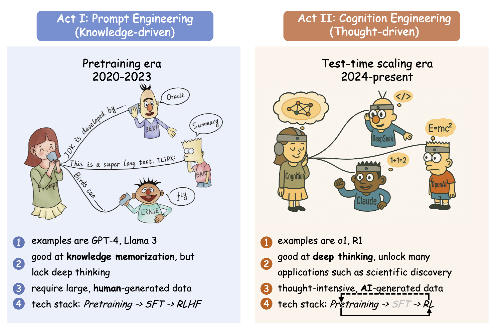
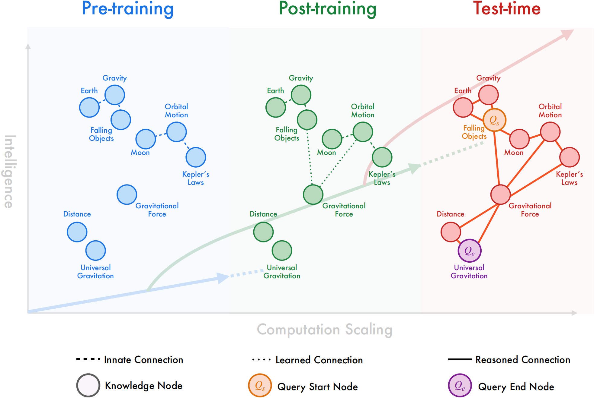
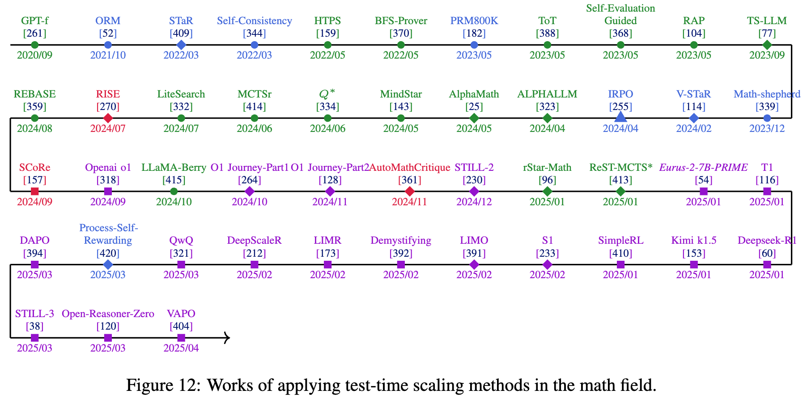
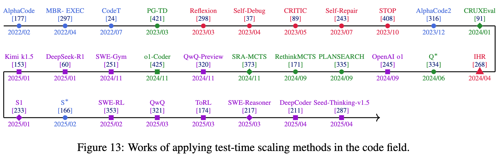
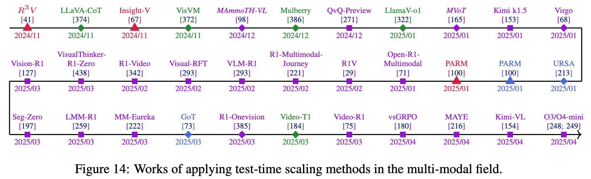
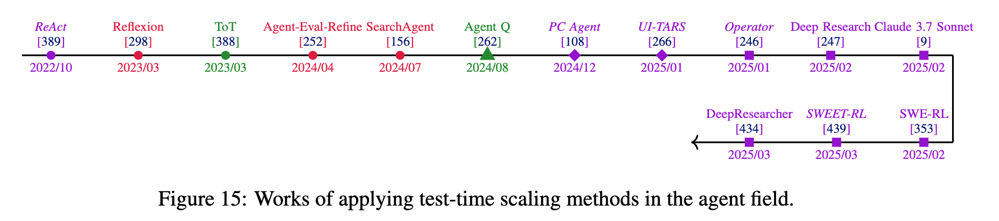
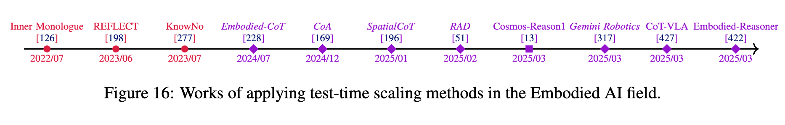
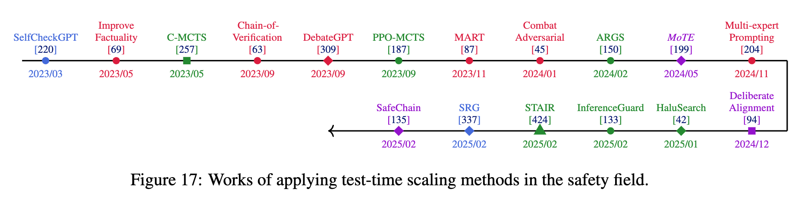
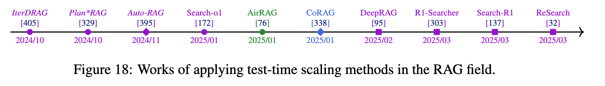
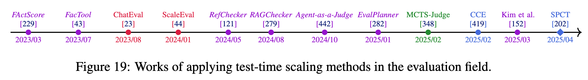

# Generative AI Act II: Test Time Scaling Drives Cognition Engineering


<p align="center">

📄 <a href="http://arxiv.org/abs/2504.13828" target="_blank">English Paper</a> &nbsp;|&nbsp;
📄 <a href="./assets/Cognition_Engineering_zh.pdf" target="_blank">Chinese Paper</a> &nbsp;|&nbsp;
🌐 <a href="https://gair-nlp.github.io/cognition-engineering/" target="_blank">Website</a> &nbsp;|&nbsp;
💡 <a href="#our-vision" target="_blank">Vision</a> &nbsp;|&nbsp;
📖 <a href="#recipestricks-for-rl-scaling">Recipes for RL Scaling</a> &nbsp;|&nbsp;
💻 <a href="#implementation-of-rl-scaling">Code Tutorial for RL Scaling</a> &nbsp;|&nbsp;
📚 <a href="./resources/papers/" target="_blank">Curated Papers (300+)</a> &nbsp;|&nbsp;
📑 <a href="#long-cot-resource" target="_blank">Long CoT Resource</a> &nbsp;|&nbsp;
📅 <a href="#development-timeline" target="_blank">Timeline</a> &nbsp;|&nbsp;
📜 <a href="#bib">Bib</a>

</p>
<p align="center">
  
</p>

The first AI generation ("Act I", 2020-2023) scaled parameters and data impressively but faced limitations in knowledge currency, reasoning depth, and cognitive flexibility. Prompt engineering became our primary AI interface.
"Act II" (2024-present) transforms models from knowledge retrievers to thought constructors through test-time scaling, establishing mind-level AI connections.
This work defines cognition engineering's foundations, provides tutorials and implementations, and democratizes access to AI's second paradigm.

# 🔥 News

- [2025-04-21] 🎉 🎉 🎉  We have released our paper *"Generative AI Act II: Test Time Scaling Drives Cognition Engineering"* along with all resources!

# 👋 Is This Paper For You?

- 👩‍🔬 As an AI researcher, are you looking for the new research direction to break through the current bottlenecks of large language models? 

- 💻 As an AI engineer, do you need a step-by-step tutorial to implement and optimize test-time scaling methods? 

- 🎓 As a student or AI newcomer, do you want a systematic framework to understand the concept and application of "cognition engineering"? 

- 👩‍🏫 As an educator, do you need structured teaching resources to explain test-time scaling? 

- 💼 As an investor or decision-maker, would you like to understand what new stage generative AI has entered? 


# Our Vision

The three scaling phases illustrated as a progression of knowledge representation. Pre-training scaling (blue) forms isolated knowledge islands with fundamental physics concepts connected by limited innate associations. Post-training scaling (green) densifies these islands with more sophisticated learned connections between related concepts. Test-time scaling (red) enables dynamic reasoning pathway formation between previously disconnected concepts through extended computation, facilitating multi-hop inference across the entire knowledge space. 
**Test-time scaling builds bridges between knowledge islands, connecting distant nodes that remain isolated during pre-training and conventional post-training**.

The emergence of cognition engineering through test-time scaling marks a fundamental paradigm shift in artificial
intelligence. Far beyond mere technical implementation, this transformation carries profound implications for how
we develop AI systems (Data Engineering 2.0), reimagine human-AI collaboration, and conduct scientific research. (See paper for details.)


# Recipes/Tricks for RL Scaling

<details>
  <summary>
    Training Algorithm
  </summary>
  <div class="table-responsive">
    <table>
      <thead>
        <tr>
          <th>Problem to Solve</th>
          <th>Method Overview</th>
          <th>Evidence</th>
          <th>Related Studies</th>
        </tr>
      </thead>
      <tbody>
        <tr>
          <td><strong>Computational inefficiency in traditional PPO for LLM training</strong></td>
          <td><strong>GRPO (Group Relative Policy Optimization):</strong> Eliminates the need for a separate value model by using the average reward of multiple outputs from the same prompt as the baseline for advantage calculation.</td>
          <td>Performance comparisons demonstrate computational efficiency while maintaining comparable effectiveness to traditional PPO, particularly well-suited for LLM reward modeling where rewards are often comparative in nature.</td>
          <td><a href="https://arxiv.org/abs/2402.03300">GRPO</a></td>
        </tr>
        <tr>
          <td><strong>Token inefficiency and overthinking in long-form reasoning</strong></td>
          <td><strong>Dr.GRPO (Doctor GRPO):</strong> Addresses optimization bias in GRPO by removing response-length normalization and reward standardization, implementing an unbiased policy gradient estimation.</td>
          <td>Experimental results show significantly improved token efficiency with better controlled response lengths, effectively mitigating overthinking problems.</td>
          <td><a href="https://arxiv.org/abs/2503.20783">Dr.GRPO</a></td>
        </tr>
        <tr>
          <td><strong>Instability with varying response lengths in long-form reasoning</strong></td>
          <td><strong>DAPO (Decouple Clip and Dynamic Sampling Policy Optimization):</strong> Implements token-level policy gradient calculation, allowing longer sequences to appropriately influence the gradient updates regardless of individual response lengths.</td>
          <td>Comparative analysis reveals more stable training dynamics with healthier entropy management and better quality pattern recognition, particularly for handling varying response lengths effectively.</td>
          <td><a href="https://arxiv.org/abs/2503.14476">DAPO</a></td>
        </tr>
        <tr>
          <td><strong>Limited policy exploration due to rigid constraints</strong></td>
          <td><strong>GPG (Group Policy Gradient):</strong> Simplifies the policy gradient approach by removing reference models and policy constraints while maintaining stability through group-level reward normalization.</td>
          <td>Comparative experiments demonstrate enhanced exploration capabilities with reduced computational requirements, providing more flexible policy updates.</td>
          <td><a href="https://arxiv.org/abs/2504.02546">GPG</a></td>
        </tr>
        <tr>
          <td><strong>Repetitive or narrow reasoning patterns</strong></td>
          <td><strong>Auxiliary entropy bonus:</strong> Incorporates an additive entropy term into the RL loss function to encourage token diversity and prevent deterministic response patterns.</td>
          <td>Experimental results show more varied and creative reasoning paths without sacrificing solution accuracy.</td>
          <td><a href="https://arxiv.org/abs/2501.11651">T1</a></td>
        </tr>
        <tr>
          <td><strong>Limitations of fixed reference models</strong></td>
          <td><strong>On-policy KL normalization:</strong> Combines KL normalization with Exponential Moving Average (EMA) updates to the reference model.</td>
          <td>Dynamic reference model updating allows for more effective RL scaling while maintaining stable training dynamics.</td>
          <td><a href="https://arxiv.org/abs/2501.11651">T1</a></td>
        </tr>
        <tr>
          <td><strong>Value model misalignment with strong prior policies</strong></td>
          <td><strong>Value-Pretraining Alignment:</strong> Implements a dedicated pretraining phase for the value model to ensure alignment with strong prior policies before RL begins.</td>
          <td>Two-stage convergence pattern shows initial range alignment followed by crucial knowledge injection, preventing collapse in output length for long-CoT tasks.</td>
          <td><a href="https://arxiv.org/abs/2503.01491">VC-PPO</a>,<a href="https://arxiv.org/abs/2504.05118">VAPO</a></td>
        </tr>
        <tr>
          <td><strong>Conflicting variance-bias requirements between value and policy optimization</strong></td>
          <td><strong>Decoupled-GAE (Generalized Advantage Estimation):</strong> Separates the λ parameter for value function and policy optimization, allowing unbiased value estimation while maintaining variance reduction benefits for policy updates.</td>
          <td>Mathematical analysis and experimental results demonstrate improved convergence rates without introducing additional bias, particularly effective for trajectory-level rewards in long CoT tasks.</td>
          <td><a href="https://arxiv.org/abs/2503.01491">VC-PPO</a>,<a href="https://arxiv.org/abs/2504.05118">VAPO</a></td>
        </tr>
        <tr>
          <td><strong>Limited exploration in constrained policy optimization</strong></td>
          <td><strong>KL Divergence Removal:</strong> Eliminates the KL penalty term that constrains policy divergence from the reference model, allowing the reasoning policy to explore more freely.</td>
          <td>Experiments reveal significant performance gains when removing constraints on policy distribution shifts during extended reasoning training.</td>
          <td><a href="https://arxiv.org/abs/2503.24290">Open-Reasoner-Zero</a>, <a href="https://arxiv.org/abs/2503.14476">DAPO</a></td>
        </tr>
        <tr>
          <td><strong>Premature deterministic behavior in RL systems</strong></td>
          <td><strong>Clip-Higher Strategy:</strong> Decouples lower and higher clipping ranges in PPO to specifically promote exploration of low-probability tokens while maintaining stability.</td>
          <td>Asymmetric clipping thresholds effectively counteract entropy collapse and maintain policy diversity throughout extended training.</td>
          <td><a href="https://arxiv.org/abs/2503.14476">DAPO</a></td>
        </tr>
        <tr>
          <td><strong>Ineffective gradient signals in late-stage training</strong></td>
          <td><strong>Dynamic Sampling:</strong> Implements an adaptive sampling approach that filters out prompts with accuracy values of exactly 0 or 1 to ensure effective gradient signals.</td>
          <td>Comparative training curves demonstrate faster convergence to target performance despite the additional computational overhead of oversampling.</td>
          <td><a href="https://arxiv.org/abs/2503.14476">DAPO</a>, <a href="https://arxiv.org/abs/2504.03380">Bae et al.</a></td>
        </tr>
        <tr>
          <td><strong>Noisy reward signals from length-truncated samples</strong></td>
          <td><strong>Overlong Filtering:</strong> Masks the loss contribution of truncated samples that exceed maximum length to prevent inappropriate penalization of otherwise sound reasoning.</td>
          <td>Ablation studies highlight substantial training stability improvements when removing noisy reward signals from length-truncated samples.</td>
          <td><a href="https://arxiv.org/abs/2503.14476">DAPO</a></td>
        </tr>
        <tr>
          <td><strong>Inconsistent advantage estimation across variable-length sequences</strong></td>
          <td><strong>Length-Adaptive GAE:</strong> Dynamically adjusts the λ parameter in GAE based on sequence length, ensuring balanced TD-error influence for both short and long outputs.</td>
          <td>Empirical tests reveal more balanced advantage estimation and improved training stability across sequences of varying lengths, particularly beneficial for long-form reasoning.</td>
          <td><a href="https://arxiv.org/abs/2504.05118">VAPO</a></td>
        </tr>
      </tbody>
    </table>
  </div>
</details>

<details>
  <summary>
    Reward Design
  </summary>
  <div class="table-responsive">
    <table>
      <thead>
        <tr>
          <th>Problem to Solve</th>
          <th>Method Overview</th>
          <th>Evidence</th>
          <th>Related Studies</th>
        </tr>
      </thead>
      <tbody>
        <tr>
          <td><strong>Uncontrolled CoT length in reasoning tasks</strong></td>
          <td><strong>Cosine Length Reward:</strong> Applies a cosine-based reward shaping that prioritizes shorter, correct CoTs while penalizing short, incorrect ones.</td>
          <td>Evaluation across diverse reasoning tasks reveals stabilized CoT length with preserved performance.</td>
          <td><a href="https://arxiv.org/abs/2502.03373">Demysitify</a></td>
        </tr>
        <tr>
          <td><strong>Reward hacking in deterministic reasoning tasks</strong></td>
          <td><strong>Accuracy+Format Reward:</strong> Combines verification of answer correctness with structured formatting requirements that enforce explicit reasoning within specialized tags.</td>
          <td>Rule-based reward systems demonstrate greater resistance to reward hacking than neural alternatives while simplifying the training pipeline.</td>
          <td><a href="https://arxiv.org/abs/2501.12948">DeepSeek-R1</a>, <a href="https://hkust-nlp.notion.site/simplerl-reason">SimpleRL</a>,<a href="https://arxiv.org/abs/2501.11651">T1</a>, <a href="https://arxiv.org/abs/2502.14768">Logic-RL</a>, <a href="https://hkust-nlp.notion.site/simplerl-reason">SimpleRL</a>,<a href="https://arxiv.org/abs/2503.04548">STILL-3</a></td>
        </tr>
        <tr>
          <td><strong>Language mixing issues in multilingual environments</strong></td>
          <td><strong>Language Consistency Incentive:</strong> Calculates rewards based on the proportion of target language words in the CoT to mitigate language mixing issues.</td>
          <td>User studies indicate enhanced readability despite minor performance trade-offs in multilingual contexts.</td>
          <td><a href="https://arxiv.org/abs/2501.12948">DeepSeek-R1</a></td>
        </tr>
        <tr>
          <td><strong>Model overthinking and verbosity</strong></td>
          <td><strong>Overthinking Length Penalty:</strong> Implements a weighted reward mechanism that penalizes excessive response length while preserving correctness to combat model overthinking.</td>
          <td>Gradually introduced length penalties resulted in more token-efficient reasoning.</td>
          <td><a href="https://arxiv.org/abs/2501.12599">KIMI-K1.5</a>,<a href="https://arxiv.org/abs/2503.14476">DAPO</a></td>
        </tr>
        <tr>
          <td><strong>Inaccurate reward modeling in nuanced domains</strong></td>
          <td><strong>Chain-of-Thought RM:</strong> Enhances reward modeling with explicit step-by-step reasoning before final correctness judgment, particularly for domains with nuanced evaluation criteria.</td>
          <td>Manual verification confirmed that CoT reward models achieved significantly higher accuracy compared to classic reward models without reasoning steps.</td>
          <td><a href="https://arxiv.org/abs/2501.12599">KIMI-K1.5</a></td>
        </tr>
      </tbody>
    </table>
  </div>
</details>

<details>
  <summary>
    Training Data
  </summary>
  <div class="table-responsive">
    <table>
      <thead>
        <tr>
          <th>Problem to Solve</th>
          <th>Method Overview</th>
          <th>Evidence</th>
          <th>Related Studies</th>
        </tr>
      </thead>
      <tbody>
        <tr>
          <td><strong>Resource-constrained RL training environments</strong></td>
          <td><strong>High-impact Sample Selection:</strong> Prioritizes training samples based on learning impact measurement.</td>
          <td>Results show significant reduction in required training data while maintaining performance.</td>
          <td><a href="https://arxiv.org/abs/2502.11886">LIMR</a></td>
        </tr>
        <tr>
          <td><strong>Training with noisy web-extracted data</strong></td>
          <td><strong>Noise Reduction Filtering:</strong> Employs filtering mechanisms to remove noisy web-extracted data.</td>
          <td>Filtered datasets demonstrate improved generalization capabilities on OOD tasks.</td>
          <td><a href="https://arxiv.org/abs/2502.03373">Demysitify</a></td>
        </tr>
      </tbody>
    </table>
  </div>
</details>

<details>
  <summary>
    Multi-stage Training
  </summary>
  <div class="table-responsive">
    <table>
      <thead>
        <tr>
          <th>Problem to Solve</th>
          <th>Method Overview</th>
          <th>Evidence</th>
          <th>Related Studies</th>
        </tr>
      </thead>
      <tbody>
        <tr>
          <td><strong>Poor readability and reasoning in direct RL approaches</strong></td>
          <td><strong>Cold-start Progression:</strong> Implements a phased training approach beginning with high-quality CoT data fine-tuning before transitioning to large-scale reinforcement learning.</td>
          <td>Models with cold-start initialization exhibit enhanced readability and reasoning capabilities compared to direct RL approaches.</td>
          <td><a href="https://arxiv.org/abs/2501.12948">DeepSeek-R1</a>, <a href="https://arxiv.org/abs/2501.11651">T1</a>, <a href="https://pretty-radio-b75.notion.site/DeepScaleR-Surpassing-O1-Preview-with-a-1-5B-Model-by-Scaling-RL-19681902c1468005bed8ca303013a4e2">DeepscaleR</a>, <a href="https://arxiv.org/abs/2503.04548">STILL-3</a></td>
        </tr>
        <tr>
          <td><strong>Inefficient training with problems of varied difficulty</strong></td>
          <td><strong>Strategic Sampling:</strong> Combines curriculum-based progression from simple to complex problems with prioritization of difficult cases where model performance is weakest.</td>
          <td>Targeted sampling approaches demonstrated faster convergence and more efficient use of computational resources during training.</td>
          <td><a href="https://arxiv.org/abs/2501.12599">KIMI-K1.5</a></td>
        </tr>
        <tr>
          <td><strong>Inefficient use of context in long-form reasoning</strong></td>
          <td><strong>Progressive Context Scaling:</strong> Implements a multi-stage training approach that gradually increases context window size as model performance begins to plateau at each level.</td>
          <td>Phased context window expansion demonstrates significant improvements in both computational efficiency and final performance metrics compared to fixed maximum context training.</td>
          <td><a href="https://pretty-radio-b75.notion.site/DeepScaleR-Surpassing-O1-Preview-with-a-1-5B-Model-by-Scaling-RL-19681902c1468005bed8ca303013a4e2">DeepscaleR</a></td>
        </tr>
        <tr>
          <td><strong>Performance gaps on challenging reasoning problems</strong></td>
          <td><strong>Targeted Annealing:</strong> Implements a final training phase on specifically mined challenging problems with a linearly decaying learning rate to refine reasoning capabilities.</td>
          <td>Enhanced performance metrics on complex reasoning tasks without compromising general capabilities.</td>
          <td><a href="https://arxiv.org/abs/2503.24290">Open-Reasoner-Zero</a></td>
        </tr>
      </tbody>
    </table>
  </div>
</details>


# Implementation of RL Scaling

#### The Practitioner’s Roadmap: How to Apply Test-Time Scaling to your Applications?


See [code](./simple_tts) for handy tutorial.


# Curated Papers
See [papers](./resources/papers/)


# Long CoT Resource

| **Work** | **Application** | **Type** | **Source** | **Quantity** | **Modality** | **Link** |
|----------|----------------|----------|------------|--------------|--------------|----------|
| O1 Journey--Part 1 | Math | Synthesize | GPT-4o | 0.3K | Text | [GitHub](https://github.com/GAIR-NLP/O1-Journey) [HuggingFace](https://huggingface.co/datasets/GAIR/o1-journey) |
| Marco-o1 | Reasoning | Synthesize | Qwen2-7B-Instruct | 10K | Text | [GitHub](https://github.com/AIDC-AI/Marco-o1) |
| STILL-2 | Math, Code, Science, Puzzle | Distillation | DeepSeek-R1-Lite-Preview, QwQ-32B-preview | 5K | Text | [GitHub](https://github.com/RUCAIBox/Slow_Thinking_with_LLMs) [HuggingFace](https://huggingface.co/datasets/RUC-AIBOX/long_form_thought_data_5k) |
| RedStar-math | Math | Distillation | QwQ-32B-preview | 4K | Text | [HuggingFace](https://huggingface.co/datasets/RedStar-Reasoning/math_dataset) |
| RedStar-code | Code | Distillation | QwQ-32B-preview | 16K | Text | [HuggingFace](https://huggingface.co/datasets/RedStar-Reasoning/code_dataset) |
| RedStar-multimodal | Math | Distillation | QwQ-32B-preview | 12K | Vision, Text | [HuggingFace](https://huggingface.co/datasets/RedStar-Reasoning/multimodal_dataset) |
| S1K | Math, Science, Code | Distillation | Gemini Flash Thinking | 1K | Text | [GitHub](https://github.com/simplescaling/s1) [HuggingFace](https://huggingface.co/datasets/simplescaling/s1K) |
| S1K-1.1 | Math, Science, Code | Distillation | DeepSeek R1 | 1K | Text | [GitHub](https://github.com/simplescaling/s1) [HuggingFace](https://huggingface.co/datasets/simplescaling/s1K-1.1) |
| LIMO | Math | Distillation | DeepSeek R1, DeepSeekR1-Distill-Qwen-32B | 0.8K | Text | [GitHub](https://github.com/GAIR-NLP/LIMO) [HuggingFace](https://huggingface.co/datasets/GAIR/LIMO) |
| OpenThoughts-114k | Math, Code, Science, Puzzle | Distillation | DeepSeek R1 | 114K | Text | [GitHub](https://github.com/open-thoughts/open-thoughts) [HuggingFace](https://huggingface.co/datasets/open-thoughts/OpenThoughts-114k) |
| OpenR1-Math-220k | Math | Distillation | DeepSeek R1 | 220K | Text | [GitHub](https://github.com/huggingface/open-r1) [HuggingFace](https://huggingface.co/datasets/open-r1/OpenR1-Math-220k) |
| OpenThoughts2-1M | Math, Code, Science, Puzzle | Distillation | DeepSeek R1 | 1M | Text | [GitHub](https://github.com/open-thoughts/open-thoughts) [HuggingFace](https://huggingface.co/datasets/open-thoughts/OpenThoughts2-1M) |
| CodeForces-CoTs | Code | Distillation | DeepSeek R1 | 47K | Text | [GitHub](https://github.com/huggingface/open-r1) [HuggingFace](https://huggingface.co/datasets/open-r1/codeforces-cots) |
| Sky-T1-17k | Math, Code, Science, Puzzle | Distillation | QwQ-32B-Preview | 17K | Text | [GitHub](https://github.com/NovaSky-AI/SkyThought) [HuggingFace](https://huggingface.co/datasets/NovaSky-AI/Sky-T1_data_17k) |
| S²R | Math | Synthesize | Qwen2.5-Math-7B | 3K | Text | [GitHub](https://github.com/NineAbyss/S2R) [HuggingFace](https://huggingface.co/datasets/S2R-data/S2R-dataset) |
| R1-Onevision | Science, Math, General | Distillation | DeepSeek R1 | 155K | Vision, Text | [GitHub](https://github.com/Fancy-MLLM/R1-Onevision) [HuggingFace](https://huggingface.co/datasets/Fancy-MLLM/R1-Onevision) |
| OpenO1-SFT | Math, Code | Synthesize | - | 77K | Text | [GitHub](https://github.com/Open-Source-O1/Open-O1) [HuggingFace](https://huggingface.co/datasets/O1-OPEN/OpenO1-SFT) |
| Medical-o1 | Medical | Distillation | Deepseek R1 | 25K | Text | [GitHub](https://github.com/FreedomIntelligence/HuatuoGPT-o1) [HuggingFace](https://huggingface.co/datasets/FreedomIntelligence/medical-o1-reasoning-SFT) |
| O1 Journey--Part 3 | Medical | Distillation | o1-preview | 0.5K | Text | [GitHub](https://github.com/SPIRAL-MED/Ophiuchus) [HuggingFace](https://huggingface.co/datasets/SPIRAL-MED/o1-journey-Ophiuchus) |
| SCP-116K | Math, Science | Distillation | Deepseek R1 | 116K | Text | [GitHub](https://github.com/AQA6666/SCP-116K-open) [HuggingFace](https://huggingface.co/datasets/EricLu/SCP-116K) |
| open-r1-multimodal | Math | Distillation | GPT-4o | 8K | Vision, Text | [GitHub](https://github.com/EvolvingLMMs-Lab/open-r1-multimodal) [HuggingFace](https://huggingface.co/datasets/lmms-lab/multimodal-open-r1-8k-verified) |
| Vision-R1-cold | Science, Math, General | Distillation | Deepseek R1 | 200K | Vision, Text | [GitHub](https://github.com/Osilly/Vision-R1) [HuggingFace](https://huggingface.co/datasets/Osilly/Vision-R1-cold) |
| MMMU-Reasoning-Distill-Validation | Science, Math, General | Distillation | Deepseek R1 | 0.8K | Vision, Text | [ModelScope](https://www.modelscope.cn/datasets/modelscope/MMMU-Reasoning-Distill-Validation) |
| Clevr-CoGenT | Vision Counting | Distillation | Deepseek R1 | 37.8K | Vision, Text | [GitHub](https://github.com/Deep-Agent/R1-V) [HuggingFace](https://huggingface.co/datasets/MMInstruction/Clevr_CoGenT_TrainA_R1) |
| VL-Thinking | Science, Math, General | Distillation | Deepseek R1 | 158K | Vision, Text | [GitHub](https://github.com/UCSC-VLAA/VL-Thinking) [HuggingFace](https://huggingface.co/datasets/UCSC-VLAA/VL-Thinking) |
| Video-R1 | Video | Distillation | Qwen2.5-VL-72B | 158K | Vision, Text | [GitHub](https://github.com/tulerfeng/Video-R1) [HuggingFace](https://huggingface.co/datasets/Video-R1/Video-R1-data) |
| Embodied-Reasoner | Embodied AI | Synthesize | GPT-4o | 9K | Vision, Text | [GitHub](https://github.com/zwq2018/embodied_reasoner) [HuggingFace](https://huggingface.co/datasets/zwq2018/embodied_reasoner) |
| OpenCodeReasoning | Code | Distillation | DeepSeek R1 | 736K | Text | [HuggingFace](https://huggingface.co/datasets/nvidia/OpenCodeReasoning) |
| SafeChain | Safety | Distillation | Deepseek R1 | 40K | Text | [GitHub](https://github.com/uw-nsl/safechain) [HuggingFace](https://huggingface.co/datasets/UWNSL/SafeChain) |
| KodCode | Code | Distillation | DeepSeek R1 | 2.8K | Text | [GitHub](https://github.com/KodCode-AI/kodcode) [HuggingFace](https://huggingface.co/datasets/KodCode/KodCode-V1-SFT-R1) |


# Development Timeline
The images present a comprehensive timeline of test-time scaling methods applied across various AI domains from 2020 to 2025. These visualizations track the evolution of key techniques including Parallel Sampling, Tree Search, Multi-turn Correction, and Long Chain-of-Thought (CoT) across different fields of application.
## Key Test-Time Scaling Methods

The research maps four primary test-time scaling approaches:

- **Parallel Sampling** (blue): Generating multiple candidate solutions in parallel
- **Tree Search** (green): Exploring decision trees to find optimal solutions
- **Multi-turn Correction** (red): Iterative refinement through multiple passes
- **Long CoT (Chain-of-Thought)** (purple): Extended reasoning chains for complex problem-solving

## Training Strategies

The methods are implemented using various training approaches:
- **SFT** (Supervised Fine-Tuning): Diamond symbol
- **DPO** (Direct Preference Optimization): Triangle symbol
- **RL** (Reinforcement Learning): Square symbol
- **Inference-only**: Circle symbol


















# Bib


If you find our paper useful for your research, please cite the following paper:

```bibtex
@misc{xia2025generativeaiactii,
      title={Generative AI Act II: Test Time Scaling Drives Cognition Engineering}, 
      author={Shijie Xia and Yiwei Qin and Xuefeng Li and Yan Ma and Run-Ze Fan and Steffi Chern and Haoyang Zou and Fan Zhou and Xiangkun Hu and Jiahe Jin and Yanheng He and Yixin Ye and Yixiu Liu and Pengfei Liu},
      year={2025},
      eprint={2504.13828},
      archivePrefix={arXiv},
      primaryClass={cs.CL},
      url={https://arxiv.org/abs/2504.13828}, 
}
```


