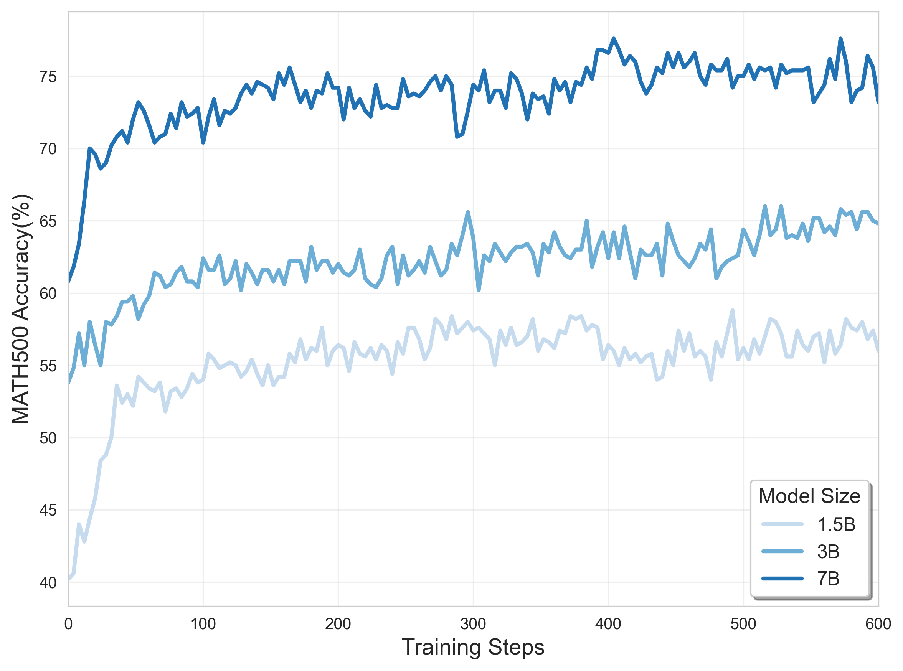
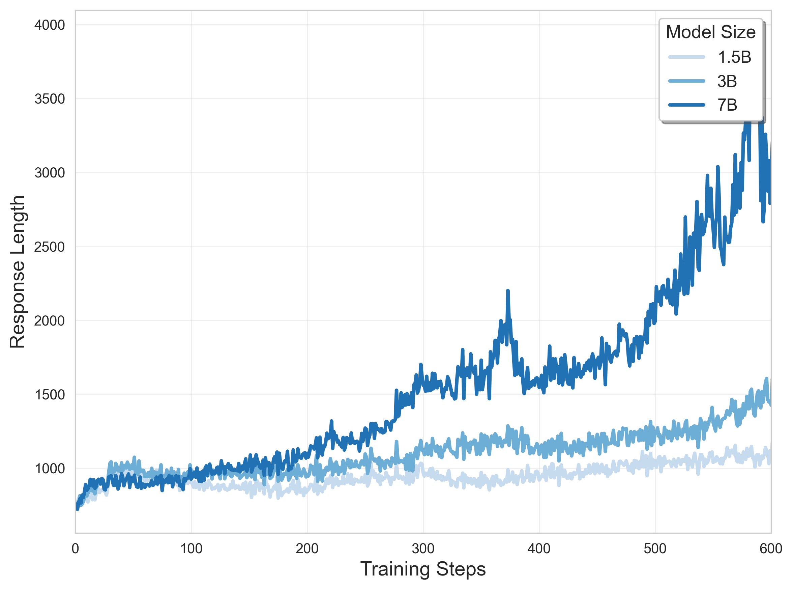

# Simple Test Time Scaling by Reinforcement Learning

This tutorial provides a reinforcement learning pipeline for enabling long-chain-of-thought (CoT) reasoning in large language models (LLMs), with a special focus on mathematical problem solving. Built on the [veRL](https://github.com/volcengine/verl) framework, this tutorial demonstrates how to use the GRPO algorithm to train base models like Qwen2.5 for improved reasoning depth and accuracy.

## 🚀 Tutorial Overview

This tutorial walks you through all the essential components to launch reinforcement learning for LLMs:

- Framework setup
- Base model selection
- Dataset preparation
- Training scripts and configurations
- Code-level understanding of the RL process

Complete this tutorial, you will get the following results:

- **Improved Accuracy**: Higher correctness on benchmarks like MATH500
- **Longer CoT**: More detailed solution steps from models

<div align="center">
  <div style="display: inline-block; text-align: center; margin: 0 10px;">
    <br/>
    <span><strong>Accuracy Curve</strong></span>
  </div>
  <div style="display: inline-block; text-align: center; margin: 0 10px;">
    <br/>
    <span><strong>Length Curve</strong></span>
  </div>
</div>


---
## Preparatory Work
### 📦 Framework and Code Structure
This tutorial selects veRL as the reinforcement learning framework. The core code about the algorithm of veRL is organized as follows:

- `trainer/`: Core training logic (e.g., training loops, loss calculation)
- `utils/`: Utilities for data processing, checkpointing, and reward computation
- `workers/`: Worker classes (actor, critic, reward model, vllm engine, etc.)
- `protocal.py`: Data protocol definitions for inter-worker communication


### 🧠 Recommended Base Models

We suggest starting with one of the following base (not SFT) models for optimal exploration during RL:

- `Qwen2.5-1.5B`
- `Qwen2.5-3B`
- `Qwen2.5-7B`

These models maintain exploratory capacity and benefit from learning diverse reasoning strategies.


#### 📚 Datasets

The provided datasets in `simple_tts/data/train` is carefully selected for balanced difficulty to encourage progressive learning and longer CoT development.

---

## ⚙️ Quick Start

```bash
git clone https://github.com/GAIR-NLP/cognition-engineering.git
cd cognition-engineering/simple_tts

# Create and activate the environment
conda create -n verl python=3.10
conda activate verl
pip install -r requirements.txt
pip3 install vllm==0.7.3
pip3 install flash-attn --no-build-isolation

# Start training
bash examples/simple_tts.sh
```

To switch models, modify the `policy_path` variable in `examples/simple_tts.sh`. You can also change dataset paths via `data.train_files` and `data.val_files`.

---

## 🔍 Understanding the RL Code

This section walks through key parts of the codebase that implement the reinforcement learning algorithm. We explain the training script, data loading, rollout logic, reward computation, and policy updates in greater detail.


### 🚦 Launch Script

The main RL training process is initiated using the following command:

```bash
python3 -m verl.trainer.main_ppo \
    algorithm.adv_estimator=grpo \
    data.train_batch_size=$rollout_batch_size \
    actor_rollout_ref.actor.ppo_mini_batch_size=$mini_batch_size \
    actor_rollout_ref.actor.kl_loss_coef=$kl_loss_coef \
    actor_rollout_ref.actor.entropy_coeff=$entropy_coeff \
    actor_rollout_ref.rollout.temperature=$temperature \
    actor_rollout_ref.rollout.n=$n_samples_per_prompts
```

**Key Arguments:**

- `algorithm.adv_estimator`: The advantage estimation method (e.g., `grpo`, `ppo`, `reinforce`).
- `data.train_batch_size`: Number of prompts per batch in training loop.
- `ppo_mini_batch_size`: Used in actor update—number of samples per gradient step.
- `kl_loss_coef`, `entropy_coeff`: Coefficients for KL divergence and entropy regularization.
- `temperature`: Sampling temperature for decoding.
- `n`: Number of generated responses per prompt during rollout.

These values are passed into Hydra-based configs and control various components in the RL loop.


### 🔄 Algorithm Flow Analysis

The core RL training logic resides in the `fit()` method of `RayPPOTrainer` within `verl.trainer.ppo.ray_trainer`. Below is a simplified version of the loop:

```python
for epoch in range(self.config.trainer.total_epochs):
    for batch_dict in self.train_dataloader:
        batch: DataProto = DataProto.from_single_dict(batch_dict)

        # Generate answers using the actor (policy) model
        gen_batch_output = self.actor_rollout_wg.generate_sequences(gen_batch)

        # Get old log probabilities (from actor model that generated the output)
        old_log_prob = self.actor_rollout_wg.compute_log_prob(batch)

        # Get reference model log probs (to compute KL divergence)
        ref_log_prob = self.ref_policy_wg.compute_ref_log_prob(batch)

        # Get critic values (optional in GRPO)
        values = self.critic_wg.compute_values(batch)

        # Compute scalar reward for each sample
        reward_tensor = self.reward_fn(batch)

        # Compute advantages using GRPO
        batch = compute_advantage(batch, adv_estimator, gamma, lam, num_repeat)

        # Update critic and actor with calculated advantages
        critic_output = self.critic_wg.update_critic(batch)
        actor_output = self.actor_rollout_wg.update_actor(batch)
```

#### Breakdown of Important Steps:

- **Data Loading**: Raw samples from the training set are converted into `DataProto` objects for structured access.
- **Rollout**: The actor model generates candidate responses via beam sampling or nucleus sampling.
- **Log Probabilities**: Log-likelihoods of outputs under the current and reference models are used to compute KL terms.
- **Reward Computation**: Scalar rewards are obtained for each generated sequence.
- **Advantage Estimation**: Using GRPO (details below), normalized advantages are computed.
- **Model Updates**: Actor and (optionally) critic networks are updated using gradient descent.


### 🧾 Data Loading and Prompt Templates

Located in `verl.utils.dataset.rl_dataset`, the dataset loader reads each math problem and formats it into prompts using a specific template designed to encourage reasoning-first behavior:

```
A conversation between User and Assistant. The user asks a question, and the Assistant solves it. The assistant first thinks about the reasoning process in the mind and then provides the user with the answer.
User: You must put your answer inside \boxed{} and Your final answer will be extracted automatically by the \boxed{} tag.
<prompt>
Assistant:
```

This formatting guides the model to perform intermediate reasoning followed by a final boxed answer, allowing precise extraction and reward computation.


### 🏆 Reward Design

Reward computation is implemented in `verl.utils.reward_score.math_verifier`:

```python
def compute_score(solution_str, ground_truth, reward_type) -> float:
    return correctness_score_default(solution_str, ground_truth)

def correctness_score_default(response, gt):
    pred = boxed_pattern.findall(response)[-1][:-1]
    return 1.0 if is_equiv(pred, gt) else -1.0
```

- **Regex Matching**: Extracts `\boxed{}` answer from the Assistant's response.
- **Equivalence Check**: Uses symbolic math (`sympy` or custom verifier) to verify mathematical equivalence.
- **Scalar Reward**: Returns +1 for correct, -1 for incorrect.

This simple reward function works well for math problems where clear answers are available.


### 📊 GRPO Advantage Estimation

Implemented in `verl.trainer.ppo.core_alogs`, GRPO (Generalized Reward Propagation Optimization) estimates advantages using only scalar outcome rewards:

```python
def compute_grpo_outcome_advantage(token_level_rewards, eos_mask, index, epsilon=1e-6):
    # Normalize reward for each sample index
    for idx in id2score:
        id2mean[idx] = torch.mean(torch.tensor(id2score[idx]))
        id2std[idx] = torch.std(torch.tensor([id2score[idx]]))

    for i in range(bsz):
        scores[i] = (scores[i] - id2mean[index[i]]) / (id2std[index[i]] + epsilon)

    # Expand scalar reward to token level and apply mask
    scores = scores.unsqueeze(-1).tile([1, response_length]) * eos_mask
    return scores, scores
```

This technique ensures the reward signal is normalized across examples, helping stabilize training. The result is a token-level advantage tensor used in loss calculation.


### 📉 Policy Loss Calculation

The loss for updating the actor model is defined in `verl.trainer.ppo.core_alogs`:

```python
def compute_policy_loss(old_log_prob, log_prob, advantages, eos_mask, cliprange):
    negative_approx_kl = log_prob - old_log_prob
    ratio = torch.exp(negative_approx_kl)

    pg_losses = -advantages * ratio
    pg_losses2 = -advantages * torch.clamp(ratio, 1.0 - cliprange, 1.0 + cliprange)

    pg_loss = verl_F.masked_mean(torch.max(pg_losses, pg_losses2), eos_mask)
    pg_clipfrac = verl_F.masked_mean(torch.gt(pg_losses2, pg_losses).float(), eos_mask)
    ppo_kl = verl_F.masked_mean(-negative_approx_kl, eos_mask)

    return pg_loss, pg_clipfrac, ppo_kl
```

- **Ratio Clipping**: Helps prevent large policy updates (standard in PPO).
- **Masked Mean**: Applies token-level masks to ensure proper averaging.
- **Output**: Returns loss value, clipping ratio, and KL for logging.

## Acknowledge
```
This tutorial is based on veRL and uses Qwen as the base model, along with NuminaMATH, MATH, and DeepScaleR as training datasets. We sincerely thank the contributors for open-sourcing their work, which made this tutorial possible.
```
